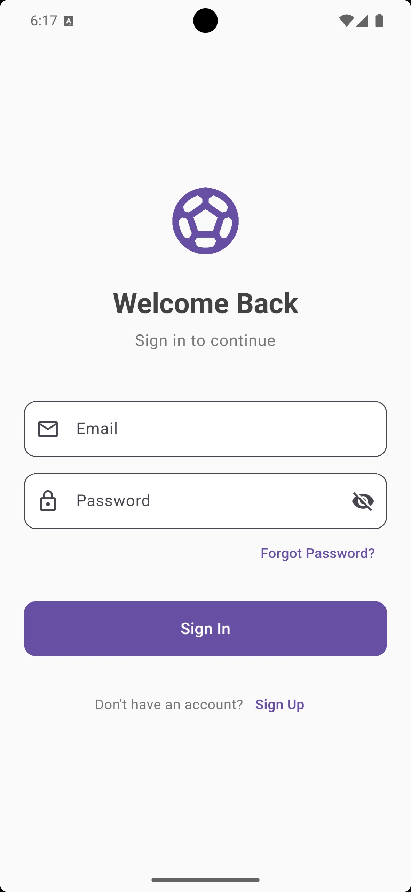
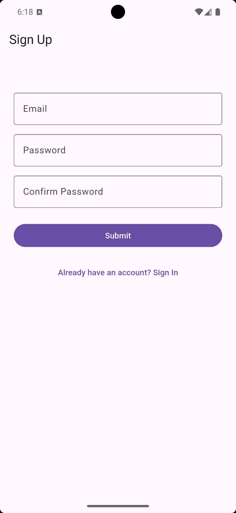
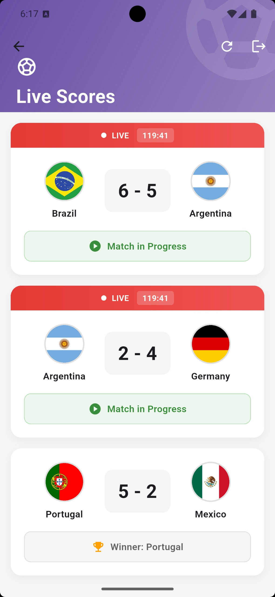

# ⚽ Football Live Score App

A high-performance, real-time football score tracking application built with **Flutter** and **Firebase**. This app provides users with instantaneous updates on live matches, scores, and match details—so users never miss a moment of the game.

---

## 📸 Screenshots

| **Sign In** | **Sign Up** | **Home Page** |
| :---: | :---: | :---: |
|  |  |  |

---

## ✨ Features

- **Real-time Updates**  
  Uses **Firebase Firestore** to deliver live match scores and updates instantly without manual refresh.

- **Secure Authentication**  
  Integrated **Firebase Authentication** for secure sign-in and sign-up using email and password.

- **Push Notifications**  
  Powered by **Firebase Cloud Messaging (FCM)** to notify users about match starts, goals, and important events.

- **Modern UI/UX**  
  Clean, responsive, and user-friendly interface built with Flutter’s widget system.

- **Detailed Match Information**  
  View live scoreboards, team details, and match-specific information in real time.

---

## 🛠️ Tech Stack

- **Frontend:** Flutter (Dart)
- **Backend:** Firebase
    - Firebase Authentication
    - Cloud Firestore
    - Firebase Cloud Messaging (FCM)
- **Version Control:** Git & GitHub

---

## 🚀 Getting Started

Follow the steps below to run this project locally.

### 1️⃣ Clone the Repository

```bash
git clone https://github.com/faiaz5415/Football-Live-score-real-time-App-using-firebase.git
```

### 2️⃣ Install Dependencies

```bash
flutter pub get
```

### 3️⃣ Firebase Setup

1. Create a new project from the **Firebase Console**.
2. Add your **Android** and/or **iOS** app.
3. Download the configuration files:
    - `google-services.json` for Android
    - `GoogleService-Info.plist` for iOS
4. Place them in the correct directories:
    - `android/app/`
    - `ios/Runner/`
5. Enable the following Firebase services:
    - Email/Password Authentication
    - Cloud Firestore
    - Firebase Cloud Messaging (optional for notifications)

### 4️⃣ Run the App

```bash
flutter run
```

---

## 👨‍💻 Author

**Kh Faiaz Hasan**  
🎓 B.Sc. in Computer Science & Engineering (CSE)  
🏫 Daffodil International University (3rd Year)

**Interests:**
- Flutter App Development
- Artificial Intelligence
- Machine Learning

🔗 **GitHub:** [@faiaz5415](https://github.com/faiaz5415)

---

## 📝 License

This project is licensed under the **MIT License**.  
See the `LICENSE` file for more information.

---

⭐ If you like this project, don’t forget to give it a star on GitHub!

